# Top-Travaux-France

**Top-Travaux-France** is a platform designed to seamlessly connect clients with skilled artisans, simplifying the process of finding professional services. Whether you're looking for a plumber, electrician, painter, or any other service, Artisan Connect helps you discover experienced artisans near you.

##    Table of Contents

*    About
*    Features
*    Installation
*    Usage
*    Contributing


##    About

**Top-Travaux-France** is an innovative solution that bridges the gap between clients and artisans. By providing a user-friendly interface, clients can easily search for artisans using various filters and criteria. Artisans, on the other hand, can showcase their skills and services, interact with clients, and build their professional reputation through reviews and ratings.

##    Features

*    **Discover Artisans:**  Explore a vast database of artisans based on your location, service category, and expertise.
*    **Advanced Search:** Utilize filters to narrow down your search and find the perfect artisan for your needs.
*    **Newsletter Subscription:** Stay updated with the latest services and promotions by subscribing to our newsletter.
*    **Artisan Profiles:** View detailed profiles of artisans, including their services, customer reviews, and contact information.
*    **User Reviews:** Leave feedback and ratings after availing services, helping others make informed decisions.
*    **404 Page:** A custom 404 error page ensures a user-friendly experience even when the requested page is not found.


##    Installation

To run Artisan Connect locally, follow these steps:

```
# Clone the repository
git clone [https://github.com/Kawkawa2/Top_Travaux

# Change directory
cd Top_Travaux

# Install dependencies
composer install

# Set up environment variables
cp .env.example .env
php artisan key:generate

# Configure the database in the .env file
# Run migrations
php artisan migrate

# Start the development server
php artisan serve

```

##    Usage

###    Home Page

On the *Home* page, users can initiate their search for artisans by entering specific keywords, selecting service categories, and specifying their location. The intuitive search interface ensures a quick and efficient search experience.

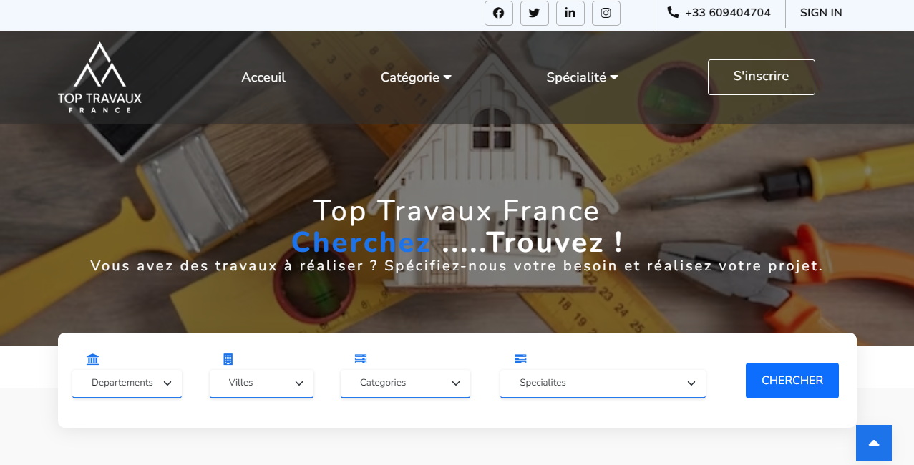
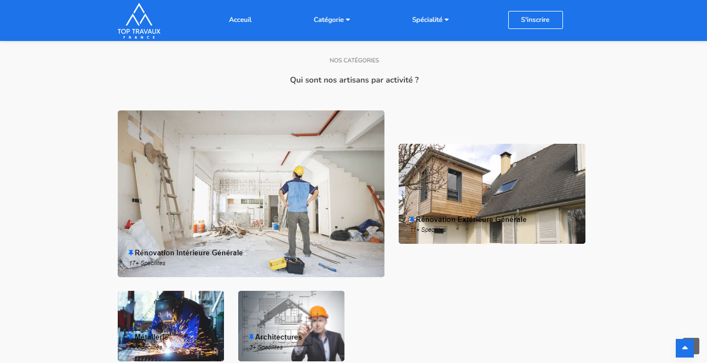
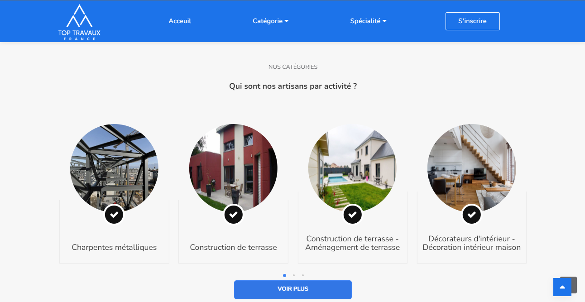


###    Search Page

The *Search* page displays the search results based on user input. Clients can explore the profiles of artisans matching their criteria, view services offered, read reviews, and contact artisans directly.

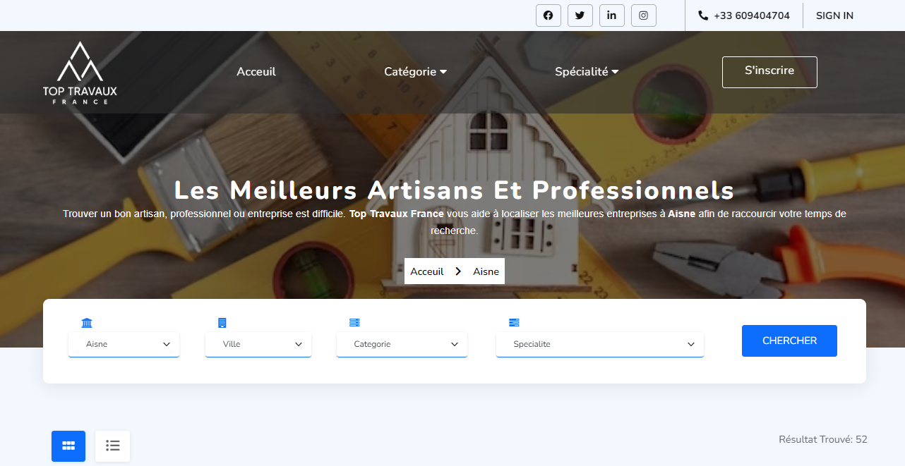
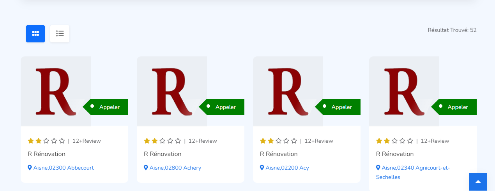

###    Newsletter Subscription

Interested users can subscribe to our newsletter to receive regular updates about new artisans, services, and special offers.

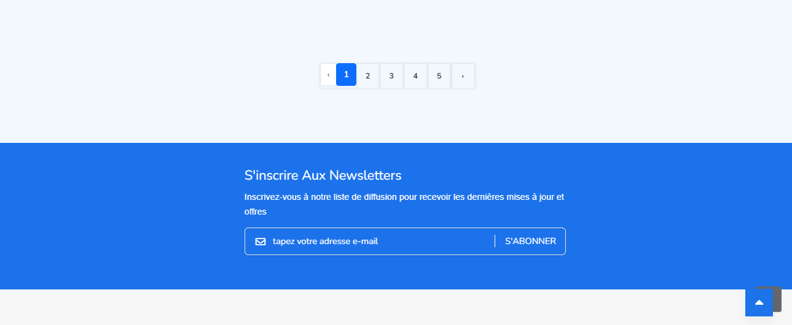

###    Profile Page

The *Profile* page provides in-depth information about individual artisans. Clients can view the artisan's bio, services, previous customer reviews, and contact details. Additionally, clients can leave their own reviews and ratings after availing services.


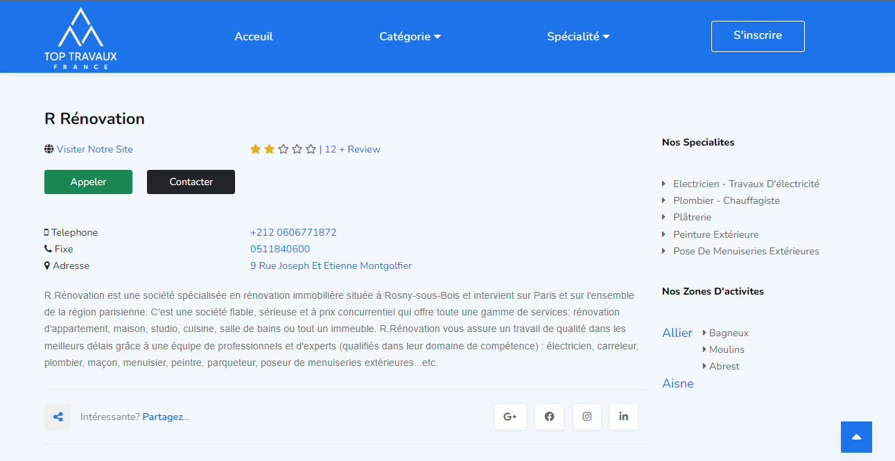
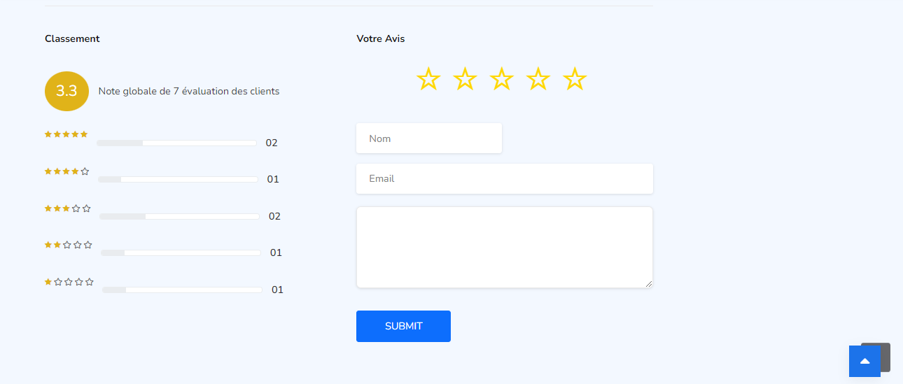
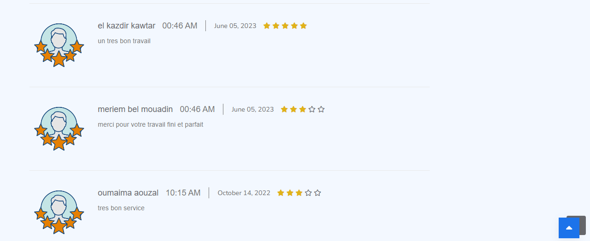
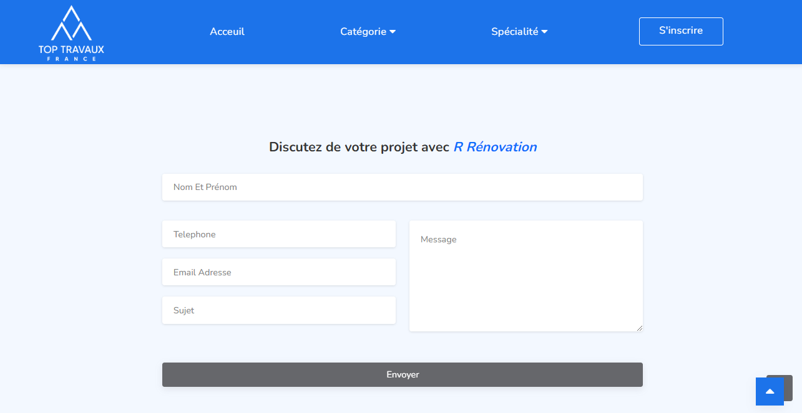

###    404 Page
The *404* page appears when the requested page is not found.

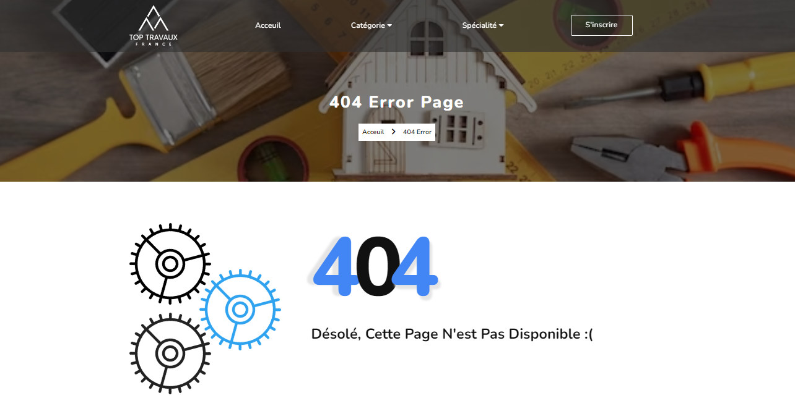

##    Contributing

We welcome contributions from the community! To contribute to Artisan Connect, follow these steps:

1. Fork the repository on GitHub.
2. Clone your forked repository to your local machine.
3. Create a new branch for your feature or bug fix.
4. Make your changes and commit them with descriptive commit messages.
5. Push your changes to your branch on your forked repository.
6. Submit a pull request to the `main` branch of the original repository.
7. Your pull request will be reviewed, and once approved, it will be merged into the main codebase.
   
